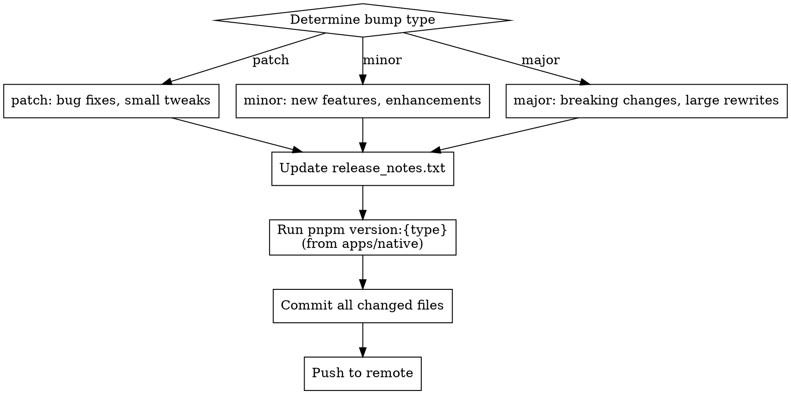

# Version Release

Bump the native app version, update release notes, commit, and push.

## Process



### 1. Determine Bump Type

| Type | When | Example |
|------|------|---------|
| `patch` | Bug fixes, small UI tweaks, copy changes | Fix receipt alignment, fix crash |
| `minor` | New features, enhancements, new screens | Add kitchen printing, add Bluetooth polling |
| `major` | Breaking changes, large rewrites, major milestones | Full redesign, API overhaul |

If the user doesn't specify, infer from recent commits since last version bump. Ask if ambiguous.

### 2. Update Release Notes

Write `apps/native/release_notes.txt` with this format:

```
## What's New

- Feature or fix description — brief detail
- Another change

## Notes

- Any caveats, behavioral notes, or migration info (optional section)
```

Content should summarize changes since the last version bump. Use `git log` to review recent commits. Keep descriptions concise and user-facing (not developer jargon).

### 3. Bump Version

```bash
cd apps/native && pnpm version:{patch|minor|major}
```

This syncs version across three files automatically:
- `apps/native/package.json`
- `apps/native/app.config.ts`
- `apps/native/android/app/build.gradle`

### 4. Commit and Push

Commit message format:
```
chore: bump version to {new_version} (v{new_version})
```

Stage these files:
- `apps/native/package.json`
- `apps/native/app.config.ts`
- `apps/native/android/app/build.gradle`
- `apps/native/release_notes.txt`

Then push to the current branch.

## Common Mistakes

- Forgetting to update `release_notes.txt` before bumping
- Using `feat:` prefix for version bump commits (use `chore:`)
- Not reviewing git log to write accurate release notes
